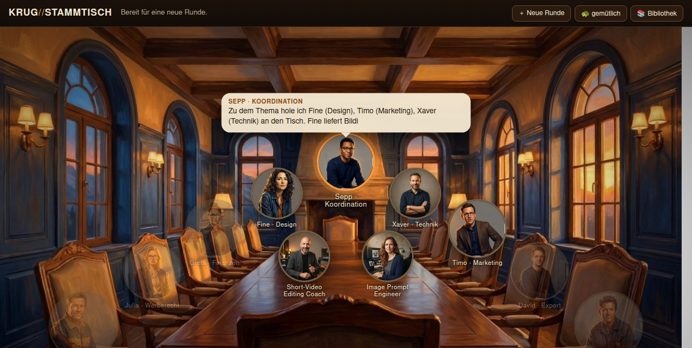

# KRUG//STAMMTISCH — ein Besprechungsraum im Browser, in dem KI-Kollegen miteinander reden



Dieses Paket enthält einen kompletten, seit Wochen laufenden Anwendungsfall: neun KI-Kollegen mit
eigenem Charakter, eigenem Gesicht und eigenem Fachgebiet sitzen an einem Tisch und besprechen ein
Thema, das der Gastgeber vorgibt. Man sieht ihnen dabei zu, kann dazwischenreden, Unterlagen auf den
Tisch legen und eine Pause einlegen. Am Ende entstehen ein Protokoll, ein PDF und eine Notiz im
eigenen Wissensspeicher.

Gebaut von Roland für seine eigenen Firmen, im Einsatz seit dem 4. September 2026.

## Was wirklich drin ist

Kein Video, keine Präsentation, sondern der laufende Code, die neun Persönlichkeiten im Wortlaut,
alle Figuren als Bilddateien und zwei Anleitungen. Wer das nachbauen will, kann das mit diesem
Paket tun.

```
README.md             diese Datei
ANLEITUNG.md          Schritt für Schritt vom leeren Server zur ersten Runde
WAS-LAEUFT-WORUEBER.md  wie das Ganze zusammenhängt: was über Claude Code läuft,
                      was über den Telegram-Bot, was reine Messskripte sind
BAUPLAN-original.md   die ausführliche Bauanleitung mit allen Entscheidungen und Fallen
software/             der Code: Motor, Wissenssuche, Ausgabe, Dienst, Oberfläche
personas/             die zehn Persönlichkeiten als Textdateien, so wie sie im Betrieb laufen
bilder/               die Figuren, der Raum, die Fachkräfte-Porträts und zwei
                      Bildschirmfotos der laufenden Oberfläche
fachkraefte/          82 Rollen, die man für eine einzelne Aufgabe dazuholen kann,
                      dazu unser deutsches Personalverzeichnis und die Lizenz
beispiel/             eine echte Runde zum Mitlesen, als Text und als PDF
```

## Was daran das Interessante ist

**Neun feste Personen, dazu 82 Fachkräfte auf Zeit.** Am Tisch sitzen der Koordinator und die
Fachleute für Recht, Finanzen, Marketing, Export, Logistik, Vertrieb, Design und Technik. Verlangt
ein Thema mehr, holt der Koordinator von selbst eine Fachkraft dazu, etwa einen
Kurzvideo-Schnittlehrer. Auf dem ersten Bildschirmfoto sieht man genau das.

**Die Kollegen reden miteinander, nicht mit dir.** Jeder Beitrag ist ein eigener Modellaufruf mit
eigener Persönlichkeit. Der Koordinator eröffnet, verteilt das Wort, fasst zwischendurch zusammen
und zieht am Ende ein Fazit. Du kannst jederzeit dazwischenrufen, dann geht der nächste Sprecher
zuerst darauf ein.

**Sie erfinden nichts.** Das ist der aufwendigste Teil und der Grund, warum das Ding brauchbar ist
statt nur hübsch. Vor jeder Runde wird eine Tischvorlage erstellt: ein eigener Durchgang sucht im
Netz, liest die genannten Seiten, sieht im eigenen Firmenwissen nach und schreibt auf, was gesichert
ist und was unklar bleibt. Jede Tatsache im Gespräch braucht eine Herkunft. Ein zweites, kleines
Modell prüft jeden Beitrag gegen und schickt ihn zurück, wenn etwas unbelegt ist. Was trotzdem offen
bleibt, steht sichtbar unter dem Beitrag.

**Es kostet fast nichts.** Die Runden laufen über das normale Abo, nicht über bezahlte Aufrufe. Eine
Runde mit fünf Teilnehmern und drei Durchgängen dauert je nach Tempo zehn bis zwanzig Minuten.

## Was du dafür brauchst

Einen kleinen Linux-Server, auf dem Claude Code angemeldet ist. Python. Einen Ordner mit Notizen,
aus dem die Kollegen ihr Firmenwissen ziehen. Mehr nicht. Ein Webserver davor ist empfehlenswert,
wenn du vom Handy zusehen willst.

## Eine ehrliche Einordnung

Der Stammtisch ersetzt keine Recherche und kein Fachgespräch mit Menschen. Er ist gut darin, einen
Gedanken von fünf Seiten zu beleuchten, blinde Flecken sichtbar zu machen und in zwanzig Minuten ein
Protokoll zu erzeugen, das man sonst nie geschrieben hätte. Er ist schlecht darin, Neues zu wissen,
das nicht in deinen Notizen oder im Netz steht.

Die Rechts- und Steuerbeiträge sind Einschätzungen, keine Beratung. Das steht auch so in den
Persönlichkeiten drin und wird eingehalten.

## Lizenz und Weitergabe

Alles Weitere steht in `LIZENZ.md`: MIT für Software und Anleitungen, MIT für die Rollen mit dem
Vermerk des Ursprungsverzeichnisses, dazu ein Wort zu Bildern und Persönlichkeiten.

Code und Anleitungen darfst du frei verwenden und verändern, auch geschäftlich. Die Bilder sind mit
einem Bildmodell erzeugt und für diesen Anwendungsfall gedacht; für eine eigene Firma würde ich
eigene Figuren erzeugen lassen, dann passen sie zur eigenen Marke. Die Persönlichkeiten beziehen
sich auf eine bestehende Firma, sie sind als Muster gedacht und nicht zum Kopieren.

Fragen? Dann frag den, der dir dieses Paket gegeben hat.
